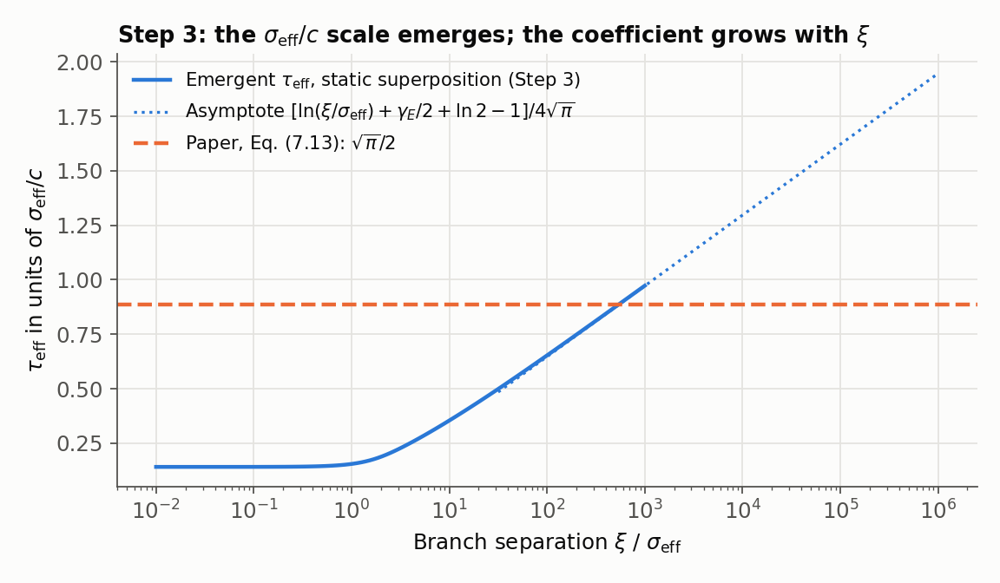
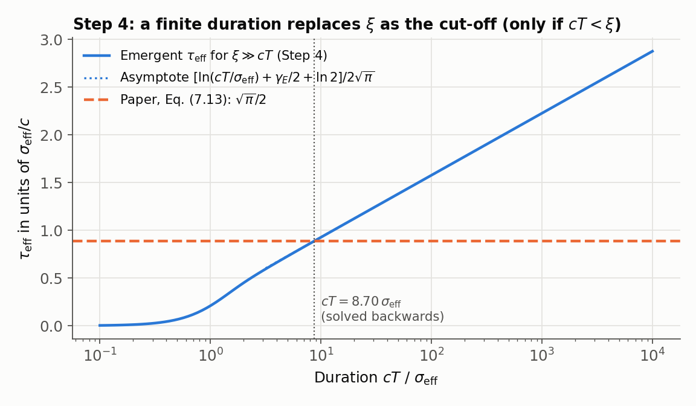
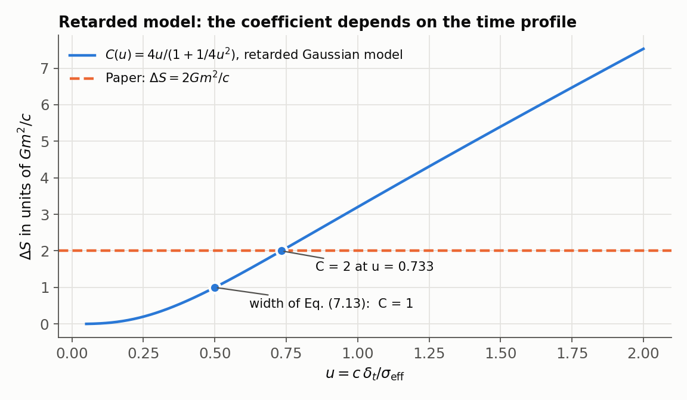
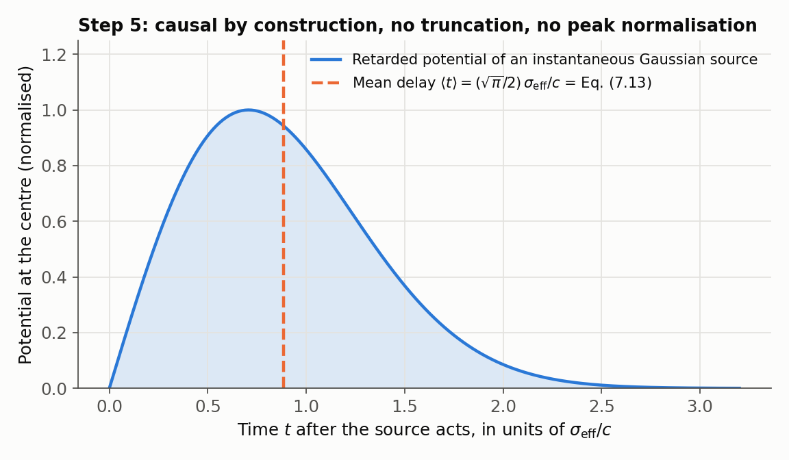
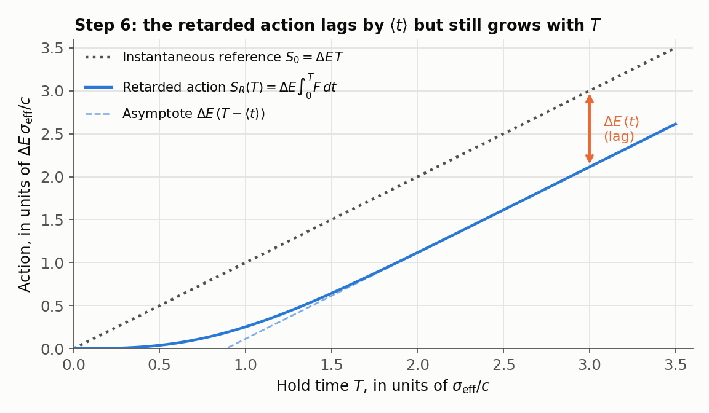

# Toy Models for the Coherence Time of the Gravitational Heisenberg Cut

Toy-model tests following up

> T. Namba, *The Spacetime Carrier Substrate: Bandlimited Information,
> Regular Geometry, and a Gravitational Heisenberg Cut* (submitted to
> *Classical and Quantum Gravity*, CQG-117584).

In that paper the action difference between two branches of a spatial
superposition is

$$
\Delta S = \Delta E_G\,\tau ,\qquad \tau = \frac{\sqrt{\pi}}{2}\,\frac{\sigma_{\rm eff}}{c}
\quad\text{(Eq. 7.13)},
$$

and the choice of $\tau$ is stated as the paper's **central physical
assumption**. It fixes $\Delta S = 2Gm^2/c$ and the Heisenberg-cut mass
$m_H = M_P/\sqrt2 \approx 15.4\ \mu$g. This repository tests which parts of
Eq. (7.13) (its scale $\sigma_{\rm eff}/c$, its coefficient $\sqrt\pi/2$, and
its independence of the separation) come out of models in which $\tau$ is
**not** put in by hand.

```
pip install -r requirements.txt
python run_all.py          # 31 checks, about 30 s
python make_figures.py     # figures/ 
```

The full output is in [`results/verification_output.txt`](results/verification_output.txt).

---

## Summary

| Question | Answer from the models | Status |
|---|---|---|
| Does the time scale $\sigma_{\rm eff}/c$ emerge? | Yes, in every model, without being assumed | ✅ supported |
| Does the coefficient $\sqrt\pi/2$ emerge? | No. Static field overlap: $1/(4\sqrt\pi)$ at small separations; retarded model with the width of Eq. (7.13): $\Delta S = Gm^2/c$ | ❌ not reproduced |
| Is $\Delta S$ independent of the separation? | No. A logarithm $\ln(\xi/\sigma_{\rm eff})$ appears; in the laboratory regime $cT \gg \xi$ it is not removed by the finite duration | ❌ not reproduced |
| Is the cut mass of order $M_P$? | Yes: $0.6$–$1.2\,m_H$ over a wide range of separations | ✅ supported |
| Is there a causal, normalisation-free time equal to Eq. (7.13)? | Yes: the **mean retardation delay** of the regularised self-interaction is exactly $\tfrac{\sqrt\pi}{2}\sigma_{\rm eff}/c$ (Step 5) | ✅ found |
| Does that delay have a meaning in terms of the action? | Yes: after a sudden switch-on the retarded action lags the instantaneous one by exactly $\Delta E\,\langle t\rangle$ (Step 6). This is a kernel-independent identity and fixes no coefficient | ✅ interpretation |
| Is $\Delta S = \Delta E_G \times$ (that delay) derived? | No. The accumulated retarded action still grows with the hold time; the physical $\Delta S$ would have to be the retardation *deficit*, which needs an extra principle. The field-overlap model weights the same physics differently and gives $1/2\pi$ of it | ❓ open |

Eq. (7.13) therefore remains an assumption, as the paper states. Its scale is
supported by the models, and Step 5 identifies a natural causal quantity with
exactly its value. Step 6 shows that this quantity is the lag of the
accumulated action behind an instantaneous interaction. What is not yet derived is why the action should
accumulate over that quantity rather than over the time scale selected by
the field overlap.

---

## Step 3 — static superposition (`step3_static.py`)

The Newtonian field is replaced by a massless quantised scalar field
($g^2 = 4\pi G$). Each branch displaces the field into a coherent state, and
the decoherence exponent is the overlap
$\Gamma = -\ln|\langle G_1|G_2\rangle|$. One finds
$\Gamma = \Delta E_G\,\tau_{\rm eff}/\hbar$ with the **emergent** time
$\tau_{\rm eff} = \langle 1/4ck\rangle$.

| Check | Result |
|---|---|
| Field-theory $\Delta E_G$ vs Eq. (7.9) of the paper | identical (rel. dev. $10^{-13}$) |
| $\tau_{\rm eff} \propto \sigma_{\rm eff}/c$ | emerges |
| Small separations | $\tau_{\rm eff} \to \sigma_{\rm eff}/(4\sqrt\pi\,c)$, i.e. $1/2\pi$ of Eq. (7.13) |
| Large separations | $\tau_{\rm eff} = \dfrac{\sigma_{\rm eff}}{4\sqrt\pi\,c}\Big[\ln\dfrac{\xi}{\sigma_{\rm eff}} + \dfrac{\gamma_E}{2} + \ln 2 - 1\Big]$ |



## Step 4 — finite duration (`step4_finite_time.py`)

The branch difference exists only for a time $T$ (sudden switch-on and
switch-off), which multiplies every mode by $4\sin^2(ckT/2)$.

| Regime | Result |
|---|---|
| $\xi \gg cT$ | $T$ replaces $\xi$ as infrared cut-off: $\tau_{\rm eff}/(\sigma_{\rm eff}/c) \to \big[\ln(cT/\sigma_{\rm eff}) + \gamma_E/2 + \ln 2\big]/2\sqrt\pi$ (exact derivative $dJ/dy = 4D(y)$, Dawson function) |
| Value of Eq. (7.13) | reached at $cT = 8.70\,\sigma_{\rm eff}$ (asymptotic approximation $e^{\pi-\gamma_E/2}/2 = 8.67$). This is **solved backwards**, not derived |
| $cT \gg \xi$ (**every laboratory experiment**: $T \gtrsim 1\ \mu$s gives $cT \gtrsim 300$ m) | the static result, doubled by the switching: $\Gamma = 2\,\Gamma_{\rm static}$. The logarithm in $\xi/\sigma_{\rm eff}$ remains |

Implied cut mass in the laboratory regime: $1.17\,m_H$, $0.83\,m_H$ and
$0.68\,m_H$ for $\xi/\sigma_{\rm eff} = 10$, $100$ and $1000$.



## Step 4, alternative — retarded Gaussian (`step4_retarded_gaussian.py`)

The branch difference is switched with a Gaussian time profile of width
$\delta_t$ and propagates with the retarded Green function. The time
correlation gives $\sqrt\pi\,\delta_t\,e^{-r^2/4c^2\delta_t^2}$, and the
spatial average of the retardation factor gives
$R(u) = 1/(1+1/4u^2)$ with $u = c\delta_t/\sigma_{\rm eff}$, so that

$$
\Delta S = C(u)\,\frac{Gm^2}{c},\qquad C(u) = \frac{4u}{1+1/4u^2}.
$$

| Check | Result |
|---|---|
| Width implied by Eq. (7.13), $\delta_t = \sigma_{\rm eff}/2c$ | $C = 1$, not 2 |
| $C = 2$ | requires $u = 0.733$ (solved backwards) |
| Long durations | $C \to 4u$: the action grows with the duration, so the protocol alone fixes no universal coefficient |



## Step 5 — mean retardation delay (`step5_mean_retardation.py`)

Instead of truncating a symmetric Gaussian time profile to $t \ge 0$ by
hand, use the retarded Green function itself. If the relative-coordinate
distribution of the paper, $P(r) \propto e^{-r^2/\sigma_{\rm eff}^2}$, acts
for an instant, the retarded potential at the centre is

$$
\phi(t) \propto t\,P(ct)\,\Theta(t),
$$

causal by construction. Its time integral is the static Newtonian potential,
and its mean delay, which does not depend on any normalisation, is

$$
\langle t\rangle = \frac{\int t\,\phi\,dt}{\int \phi\,dt}
= \Big\langle \frac{r}{c} \Big\rangle_{P(r)/r}
= \frac{\sqrt\pi}{2}\,\frac{\sigma_{\rm eff}}{c},
$$

exactly the value of Eq. (7.13). Physically, it is the light travel time
across each pair separation, averaged with the Newtonian weight that defines
the self-energy.

| Check | Result |
|---|---|
| $\phi(t) = t P(t)$ from the retarded integral, zero for $t<0$ | confirmed |
| $\int\phi\,dt$ = static Newtonian potential | exact |
| $\langle t\rangle$ | $(\sqrt\pi/2)\,\sigma_{\rm eff}/c$ to $10^{-12}$, independent of normalisation |
| $\Delta E_G^{\rm sat}\,\langle t\rangle$ | $2Gm^2/c$, i.e. Eq. (7.14) — **given** the identification $\Delta S = \Delta E_G\langle t\rangle$ |
| Plummer kernel (Section 4 of the paper) | $\langle t\rangle = b_0/c$: the coefficient is kernel dependent |
| Step 3 at small separations | $1/2\pi$ of $\langle t\rangle$: the two averages differ |

This removes two ad hoc steps of the half-line reading (truncation of a
non-causal kernel and peak normalisation). The remaining assumption is the
identification $\Delta S = \Delta E_G\,\langle t\rangle$. The field-overlap model of
Step 3 averages over mode frequencies instead of over retardation delays;
deciding which average is physical is the open question.



## Step 6 — the delay as a lag of the action (`step6_action_lag.py`)

Switch the branch difference on suddenly at $t=0$ and hold it. With the
normalised retarded response $q(t)$ of Step 5, the fraction of the
interaction that has arrived by time $t$ is $F(t)=\int_0^t q\,du$; for the
Gaussian distribution $F(t) = 1-e^{-(ct/\sigma_{\rm eff})^2}$. The accumulated
retarded action and the instantaneous reference are

$$
S_R(T) = \Delta E\int_0^T F(t)\,dt ,\qquad S_0(T) = \Delta E\,T ,
$$

and

$$
\lim_{T\to\infty}\,[S_0(T) - S_R(T)] = \Delta E\int_0^\infty [1-F(t)]\,dt
= \Delta E\,\langle t\rangle = \Delta E\,\frac{\sqrt\pi}{2}\frac{\sigma_{\rm eff}}{c},
$$

which with $\Delta E_G^{\rm sat}$ equals $2Gm^2/c$.

| Check | Result |
|---|---|
| $F(t)$ for the Gaussian | $1 - e^{-(ct/\sigma_{\rm eff})^2}$ |
| $S_0 - S_R$ as $T\to\infty$ | $\Delta E\,(\sqrt\pi/2)\,\sigma_{\rm eff}/c$ to $10^{-11}$ |
| $S_R(T) - \Delta E\,(T-\langle t\rangle)$ | $\to 0$ ($10^{-12}$ at $T=5$): the retarded action lags by exactly $\langle t\rangle$ |
| $dS_R/dT$ at late times | $\Delta E$: the accumulated action still grows with $T$ |
| Plummer kernel | deficit $= \langle t\rangle = b_0/c$ |
| Exponential response $q = e^{-t}$ | deficit $= \langle t\rangle = 1$ |

**Reading.** The relation is the survival-function identity
$\int_0^\infty(1-F)\,dt = \int_0^\infty t\,q\,dt$, valid for any normalised
causal response. It therefore fixes no coefficient: $\sqrt\pi/2$ enters only
through the Gaussian kernel of Step 5. What it does establish is the meaning
of $\langle t\rangle$: the time lag of the gravitational interaction, and
$\Delta E\,\langle t\rangle$ is the action that retardation has not yet
accumulated. The action actually accumulated between the branches,
$S_R(T)$, still grows linearly with the hold time, as in Step 4 and in
Diósi–Penrose. $S_0$ is a non-relativistic reference, not a physical branch.
Identifying the $\Delta S$ of the Heisenberg cut with the deficit
$S_0 - S_R$ rather than with $S_R(T)$ requires an additional physical
principle, which is the open question.



---

## Caveats

1. **Scalar stand-in.** Gravity is a tensor field; numerical factors will change.
2. **Idealised switching.** Sudden or Gaussian switching of the branch
   difference is a model of the split–hold–recombine protocol, not a solution
   of the dynamics that separates the branches.
3. **Radiation versus constraint.** In general relativity the Newtonian field
   is a constraint, and physical which-path information is carried by
   radiation emitted while the superposition is created and closed
   (Belenchia *et al.*, *Phys. Rev. D* **98** 126009, 2018; Danielson,
   Satishchandran and Wald, *Phys. Rev. D* **105** 086001, 2022).

## Next steps

- Distinguish the **experimental duration** from a possible **intrinsic
  carrier response time**. The models above show that the former does not
  produce a universal coefficient; a derivation of Eq. (7.13) must therefore
  come from a dynamical equation for the carrier itself.
- Compute the branch phase difference $\Gamma(T)$ directly for a superposition
  created at $t=0$ under the retarded field, and test whether the intercept
  $b$ of its late-time form $\Gamma(T) = aT + b$ corresponds to
  $\Delta E\,\langle t\rangle$ (Step 6). This would decide whether the
  retardation deficit has a physical role in decoherence.
- Decide between the two averages: the position-space mean retardation delay
  (Step 5, gives Eq. 7.13 exactly) and the mode-space mean inverse frequency
  selected by the field overlap (Step 3, gives $1/2\pi$ of it).
- An earlier reading: a Gaussian spatial filter $e^{-\sigma_{\rm eff}^2k^2/4}$
  combined with $\omega = ck$ gives the temporal profile
  $e^{-(ct/\sigma_{\rm eff})^2}$, whose integral over $t \ge 0$ is
  $\tfrac{\sqrt\pi}{2}\sigma_{\rm eff}/c$. This reproduces the form of
  Eq. (7.13) but is an **interpretation, not a derivation**: the peak
  normalisation $I(0) = 1$, the truncation of a non-causal kernel to
  $t \ge 0$, and the identification $\Delta S = \Delta E_G \int_0^\infty I\,dt$
  are all assumptions, and the models above that compute the overlap directly
  do not give this coefficient.
- Repeat Steps 3–4 for linearised tensor gravity with a physical
  split–hold–recombine trajectory.

## Acknowledgment

The calculations were developed with the assistance of AI tools (Anthropic
Claude and OpenAI ChatGPT). Every result stated above is checked by the
scripts in this repository.

## License

MIT
