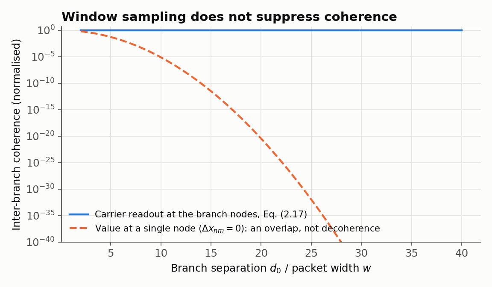
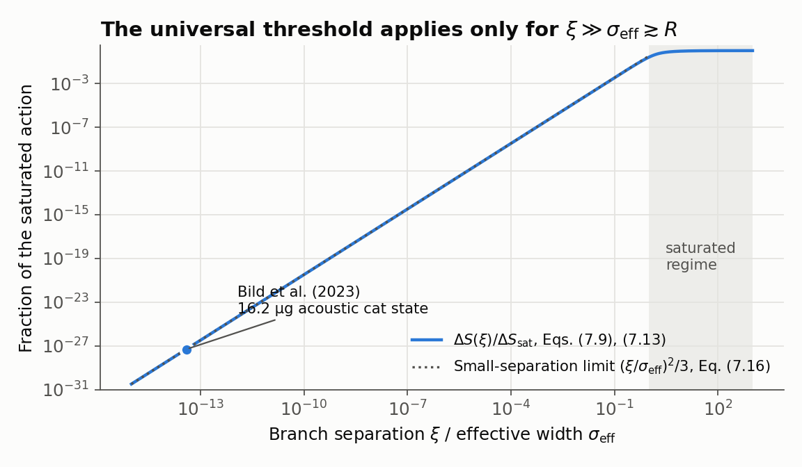
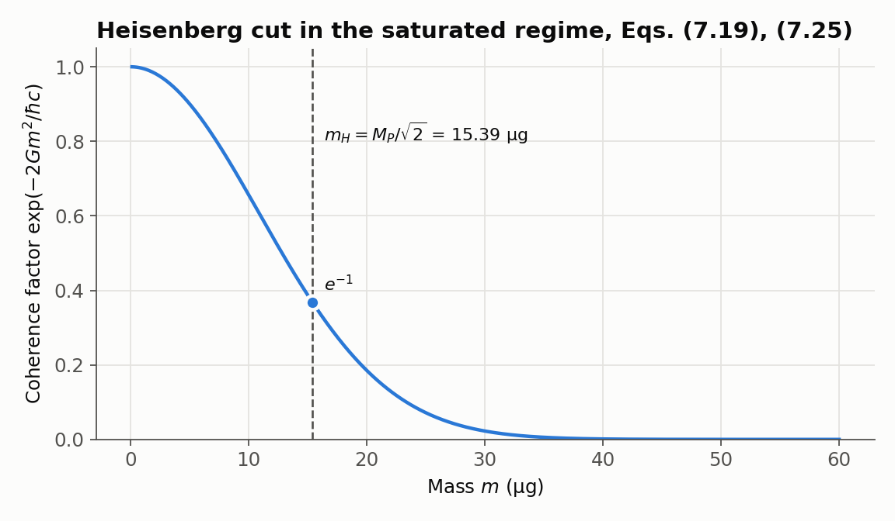

# The Spacetime Carrier Substrate — Verification Code

Numerical verification of the equations in

> T. Namba, *The Spacetime Carrier Substrate: Unifying Quantum Measurement,
> Regular Geometry, and Holographic Entropy via Bandlimited Information*
> (submitted to *Classical and Quantum Gravity*).

Every script re-derives a result of the paper **independently** and compares
it with the equation printed in the manuscript. It does not copy the paper's
closed forms into the test. For example, the curvature is not taken from
Eq. (4.38). It is rebuilt from the metric (4.22) through numerically
computed Christoffel symbols and the full Riemann tensor. The interaction
energy of Eq. (7.8) is checked against a 6D Monte Carlo integral over both
branch densities.

```
python verification/run_all.py
```

```
  OK     12/12   Section 2  Carrier window sampling (Eqs. 2.2-2.19)
  OK     22/22   Section 3  Dissipative duality and Krein embedding (Eqs. 3.4-3.36)
  OK     30/30   Sections 4 & 6  Regular geometry, curvature and energy conditions
  OK     15/15   Section 5  Information geometry, volume deficit and counting
  OK     20/20   Section 7  Gravitational back-reaction and the Heisenberg cut
  OK     15/15   Section 8  Observational status (and Eq. 2.20)

  114/114 checks passed in 3.1 s
```

The full output is in [`results/verification_output.txt`](results/verification_output.txt).
Requirements: Python ≥ 3.10, NumPy, SciPy and Matplotlib (figures only).

> **日本語要約**
> 本リポジトリは、上記論文の各式を独立に再計算し、論文に書かれた式と数値的に照合する検証コードです。論文の閉じた式をそのままテストに書き写すのではなく、たとえば曲率は計量から Christoffel 記号と Riemann テンソルを数値的に組み立て直し、第7節の相互作用エネルギーは6次元モンテカルロ積分で確かめています。`python verification/run_all.py` で全114項目の検証が約3秒で実行されます。

---

## What each script checks

| Script | Paper | Independent method | Main results confirmed |
|---|---|---|---|
| `sec2_window_sampling.py` | §2, Eqs. (2.2)–(2.19) | direct numerical integration of the window readout (2.8) | readout of a pure state is **rank one**; closed form (2.17); coherence at the branch nodes independent of $d_0$; only a trans-Planckian momentum filter; weights $\lvert c_k\rvert^2$ |
| `sec3_krein_duality.py` | §3, Eqs. (3.4)–(3.36) | brute-force null space of $\eta K + K^T\eta = 0$; phase-space grid model of Eq. (3.8) | $P = R = 0$ for **every** solution; split signature $(N,N)$; pseudo-unitarity; $\{C,K\} = 0$; capacity ratio $1/2$; $\Theta K\Theta^{-1}$ keeps the contractive spectrum (Eq. 3.16); Remark 2 identity and bound |
| `sec4_6_regular_geometry.py` | §4, §6 | Riemann tensor from the metric by finite differences; quadrature | $U_{\rm self} = -\tfrac{3\pi}{32}GM^2/b_0$; $M_{\rm hor} = \tfrac{3\sqrt3}{4}b_0c^2/G$; $R(r)$ (4.38); $K(0)$; Gauss–Bonnet; $\rho, p_r, p_t$ from $G^\mu{}_\nu$; NEC everywhere; SEC violated for $r < \sqrt{2/3}\,b_0$; Gaussian-kernel threshold $\approx 0.95\,\sigma_0c^2/G$ |
| `sec5_information_geometry.py` | §5 | Gauss–Hermite quadrature; exact geodesic-ball volumes on $S^n$, $H^n$ | Fisher metric $\delta_{\mu\nu}/\sigma_0^2$; Bhattacharyya overlap; deficit coefficient $R/(6(n+2))$ = $R/36$ in 4D; $\lambda_{\rm joint} = 1/4$; the role of assumption (A3) |
| `sec7_heisenberg_cut.py` | §7 | radial quadrature **and** 6D Monte Carlo of Eq. (7.6) | $\sigma_{\rm eff}^2 = 2\sigma^2 + \sigma_0^2$ (and $+4s_m^2$ for extended bodies); saturation (7.12); $\tau$ (7.13); $\Delta S = 2Gm^2/c$ independent of $\sigma_{\rm eff}$; small-$\xi$ limit (7.16); $m_H = M_P/\sqrt2 = 15.39\ \mu$g; Fisher–Bhattacharyya correspondence (7.23) |
| `sec8_observables.py` | §8, Eq. (2.20) | exact Schwarzschild tortoise coordinate; root finding on the regular metric | Bild et al. (2023): $\Delta S/\hbar \sim 10^{-27}$; echo delay ≈ 0.1 s for $30\,M_\odot$; photon-sphere and shadow coefficients $-10/9$, $-2/3$; sub-mm null result; CSL heating units |

### The checks can fail

The suite was mutation-tested: re-introducing an incorrect coefficient in
Eq. (4.38) or (6.11), a wrong SEC radius, a spurious sampling suppression in
Eq. (2.17), or a 5 % error in $\sigma_{\rm eff}$ each makes the corresponding
checks fail.

## Figures

`python verification/make_figures.py` writes the figures to `figures/`.

| | |
|---|---|
|  | **Fig. 1** Section 2: the carrier readout keeps the full coherence between separated branches at every separation. |
|  | **Fig. 2** Section 7: the action difference saturates only for separations larger than the object. The 16.2 µg acoustic cat state of Bild et al. (2023) lies thirteen orders of magnitude below that regime. |
|  | **Fig. 3** Section 7: coherence factor in the saturated regime and the Heisenberg-cut mass $m_H$. |

## What is verified and what is assumed

The code checks that the equations of the paper are **mathematically
correct and mutually consistent**. It does not, and cannot, test the
physical hypotheses on which the paper builds. The paper states these as
assumptions, and so does this repository:

| Assumption | Where | Status in this code |
|---|---|---|
| Finite-dimensional, frozen-time Hurwitz generator | Assumption 1 (§3.4) | Illustrated in a grid model (simple zero mode, strictly negative real parts on its complement); not proven in general |
| Plummer or Gaussian form of the carrier impulse response | §4.1, §4.5 | Both kernels checked; coefficients are kernel dependent |
| Lorentzian signature via the fundamental symmetry $J$ | §5.1 | Postulate; not tested |
| Counting assumptions (A1)–(A3) for the area law | §5.4 | The code shows explicitly that the factor 1/4 requires (A3) |
| Coherence time $\tau = \sqrt\pi\,\sigma_{\rm eff}/2c$ | Eq. (7.13) | Stated hypothesis; the rescaling for $\tau = \alpha\sigma_{\rm eff}/c$ is checked |
| Contact condition $\lvert\Delta\theta\rvert = 2r_g$ | Eq. (7.20) | Stated conjecture; the correspondence (7.23) holds under it |
| Near-horizon reflection for echoes | §8.2 item 2 | Conditional; only the delay is checked |

## Repository layout

```
verification/
  common.py                      constants (CODATA via SciPy) and the Report class
  sec2_window_sampling.py
  sec3_krein_duality.py
  sec4_6_regular_geometry.py
  sec5_information_geometry.py
  sec7_heisenberg_cut.py
  sec8_observables.py
  run_all.py                     runs everything; exit code 0 if all checks pass
  make_figures.py
figures/                         PNG figures used above
results/verification_output.txt  full output of run_all.py
```

## Citation

```bibtex
@article{taishi_carrier_substrate,
  author  = {taishi, Namba},
  title   = {The Spacetime Carrier Substrate: Unifying Quantum Measurement,
             Regular Geometry, and Holographic Entropy via Bandlimited Information},
  note    = {Submitted to Classical and Quantum Gravity},
  year    = {2026}
}
```

## License

MIT; see [LICENSE](LICENSE).
